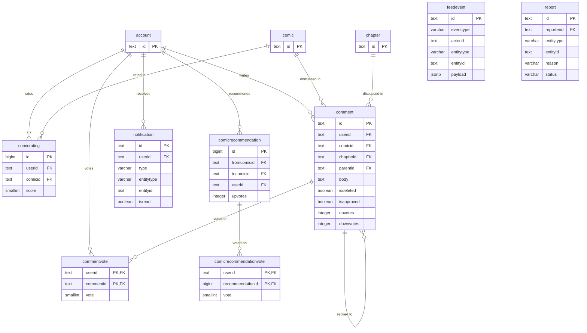

# Yomira — Entity Relationship Diagram

> Rendered natively trên GitHub via [Mermaid](https://mermaid.js.org/).  
> Schema version **1.0.0** — Updated 2026-02-21.  
> Chia thành 6 diagram theo schema để dễ đọc.

---

## Table of Contents

1. [Overview — Schema Map](#1-overview--schema-map)
2. [users — Authentication & Profiles](#2-users--authentication--profiles)
3. [core — Content Catalog](#3-core--content-catalog)
4. [library — User Shelf](#4-library--user-shelf)
5. [social — Community & Forum](#5-social--community--forum)
6. [crawler — Content Ingestion](#6-crawler--content-ingestion)
7. [analytics & system](#7-analytics--system)

---

## 1. Overview — Schema Map

High-level view of the 7 schemas and their major cross-schema relationships.

---

## 2. users — Authentication & Profiles

---

## 3. core — Content Catalog

### 3a. Comic & Metadata

### 3b. Chapter & Scanlation

---

## 4. library — User Shelf

---

## 5. social — Community & Forum

### 5a. Comments & Ratings

### 5b. Forum

---

## 6. crawler — Content Ingestion

---

## 7. analytics & system

---

## Key Conventions

| Symbol | Meaning |
|---|---|
| `PK` | Primary Key |
| `FK` | Foreign Key |
| `UK` | Unique constraint |
| `\|\|--o{` | One to zero-or-many |
| `\|\|--o\|` | One to zero-or-one |
| `\|\|--\|{` | One to one-or-many |

> **Note:** `analytics.pageview` and `analytics.chaptersession` do not have FK constraints on `userid` and `chapterid` to avoid partition overhead. Referential integrity is ensured by the application layer.
